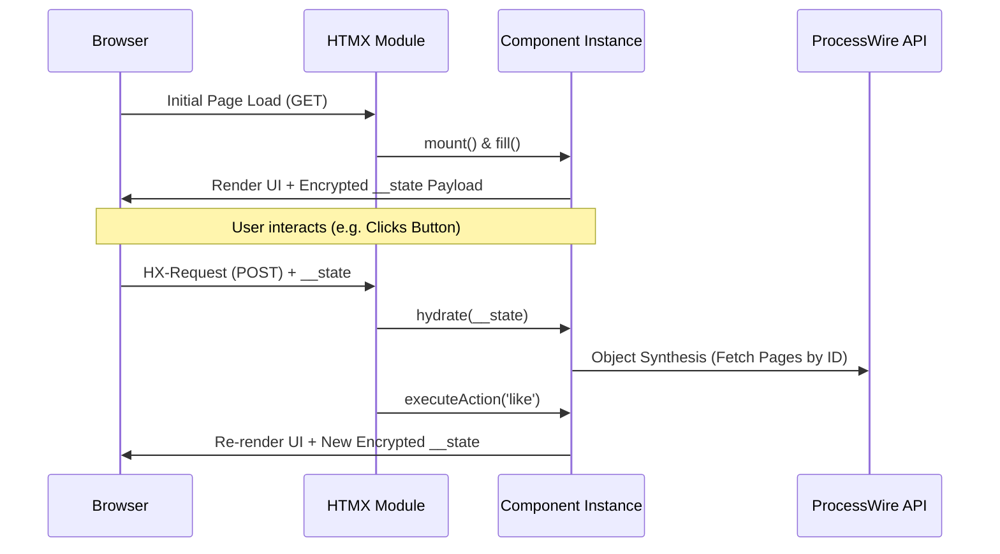

# ProcessWire HTMX Module


A powerful HTMX integration module designed specifically for ProcessWire. It bridges the gap between client-side reactivity and server-side authority, enabling you to build SPA-like interactions without abandoning traditional PHP rendering.

By unifying **State-Aware Components**, **HMAC-SHA256 Payload Security**, and ProcessWire's native architecture, this module provides the ultimate Developer Experience (DX) inspired by frameworks like Livewire—exclusively for ProcessWire.

---

## 🏗 Executive Overview

- **Natively Bundled:** Supplies HTMX 2.x, WebSockets (`ws.js`), Server-Sent Events (`sse.js`), along with key extensions and `_hyperscript`, completely zero-dependency.
- **State-Aware Component Architecture:** Seamless data hydration and dehydration between requests.
- **Object Synthesis:** Magically serialize full ProcessWire objects (like `Page`) down to lightweight secure IDs, restoring them effortlessly on the next request.
- **Cryptographic Security:** End-to-end state manipulation protection with built-in HMAC-SHA256 signatures and TTL-based Replay Protection.
- **Fluent Request/Response API:** Intercept, retarget, flash messages, and trigger custom JS events directly from ProcessWire controllers.

---

## ⚙️ Installation

**Via Composer (Recommended):**

```bash
composer require trk/processwire-htmx
```

**Via Manual Download:**

1. Clone or extract into `site/modules/Htmx/`.
2. In the ProcessWire Admin, log in and navigate to **Modules > Refresh**.
3. Install **HTMX**.

---

## 🧠 Core Architecture: Component Lifecycle

The true power of this module lies in the `Component` class. It shifts PHP from a "fire-and-forget" mentality to a persistent, stateful application logic container.



---

## 🚀 Quick Start: Building a Stateful Component

Let's build a Livewire-style "Like" button that remembers its state, seamlessly tied to a specific ProcessWire Page.

### 1. Create Your Component (`LikeButton.php`)

```php
namespace ProcessWire;

use Totoglu\Htmx\Component;

class LikeButton extends Component {

    // ProcessWire Objects are automatically synthesized!
    public Page $post;

    // Public properties are securely preserved across requests
    public int $likes = 0;

    /**
     * Optional: Hook executed upon initialization
     */
    public function mount() {
        if ($this->likes === 0) {
            $this->likes = $this->post->num_likes ?? 0;
        }
    }

    /**
     * Action triggered from the frontend.
     * Dependencies (like $session) are Auto-Injected!
     */
    public function like(int $step = 1, Session $session) {
        $this->likes += $step;

        // Let's also save to the DB...
        $this->post->of(false);
        $this->post->num_likes = $this->likes;
        $this->post->save('num_likes');

        $session->message("You liked {$this->post->title}!");
    }
}
```

### 2. The Component View (`components/like-button.php`)

Build the markup. You have full access to `$this` (the component context).

```php
<div id="<?= $this->id ?>" hx-post="./" hx-target="this">
    <h3><?= $this->post->title; ?></h3>
    <p>Total Likes: <?= $this->likes; ?></p>

    <!-- Secure State Payload (Required to maintain state) -->
    <?= $this->renderStatePayload(); ?>

    <!-- Action Trigger (hx__action routes to the "like" method) -->
    <button class="uk-button" type="submit" name="hx__action" value="like">
        Like +1
    </button>
</div>
```

### 3. Rendering The Component (Flexible Views)

The **`renderComponent()` DX Helper** dynamically manages initialization, hydration, action execution, and rendering. The third parameter (`$view`) is incredibly flexible—you can pass a file path, a raw HTML string, or an Object-Oriented `Ui` component!

**Option A: Using a View File (Classic Approach)**

```php
$htmx = wire('htmx');

// Renders the component using an external PHP template
echo $htmx->renderComponent(LikeButton::class, [
    'post' => $page,
    'likes' => 0
], 'components/like-button.php');
```

**Option B: Using a Raw HTML String (e.g. A Click Counter)**
Imagine a simple `ClickCounter` component class holding a `$count` property and an `increment` method. You don't even need an external view file:

```php
// Renders the component immediately using a raw string view
echo $htmx->renderComponent(ClickCounter::class, ['count' => 0], "
    <div id='counter-{{id}}' hx-post='./' hx-target='this'>
        <p>Clicks: <?= \$this->count ?></p>
        <?= \$this->renderStatePayload() ?>
        <button type='submit' name='hx__action' value='increment'>+1</button>
    </div>
");
```

**Option C: Using an Object-Oriented `Ui` Component**
If you prefer a strictly typed, object-oriented DOM building approach, pass a `Totoglu\Htmx\Ui` subclass as the view:

```php
// 1. Define your simple, reusable Ui Component
class Button extends \Totoglu\Htmx\Ui {
    public function render(): string {
        $label = $this->esc($this->param('label', 'Click Me'));
        return "<button {$this->attributes->render()}>{$label}</button>";
    }
}

// 2. Instantiate and attach it to your State-Aware Component
$btnView = new Button(['label' => 'Like +1', 'style' => 'primary']);
$btnView->hx('post', './')->hx('target', 'this')
        ->setAttribute('name', 'hx__action')
        ->setAttribute('value', 'like');

// 3. The $btnView automatically merges with the Component state and lifecycle!
echo $htmx->renderComponent(LikeButton::class, ['likes' => 0], $btnView);
```

---

## 🔒 Security & Data Integrity

Working with state on the client side requires strict validation to prevent tampering.

1. **Instance Isolation:** Every component is dynamically assigned a unique internal `__id`. Two instances of the same component on the same page will never collide or mix state.
2. **Cryptographic Signatures:** The HTML payload outputted by `$this->renderStatePayload()` is HMAC-SHA256 signed using the ProcessWire `$config->userAuthSalt` configuration. Any manual tampering of the hidden input in the browser will result in immediate rejection.
3. **Replay Protection (TTL):** State payloads have an expiration time (default 24 hours). You can customize this by passing `$this->renderStatePayload(ttlHours: 2)`.

---

## ⚡ Fluent Request / Response Flow

HTMX operates heavily on headers to control browser actions. The `htmx` API variable removes the headache of standard `header()` manipulations.

### Inspecting Requests

```php
$htmx = wire('htmx');

// Advanced Inspection
if ($htmx->request->isHtmx()) {
    $target  = $htmx->request->target();    // e.g. '#modal-content'
    $trigger = $htmx->request->triggerName(); // e.g. 'delete-btn'

    // Automatically validate ProcessWire CSRF with HTTP 403 handling
    $htmx->request->validateCsrf(throwException: true);
}
```

### Commanding Responses

Inject actions right back to the browser:

```php
// Redirect handling natively mapped to HTMX headers
$htmx->response->redirect('/dashboard/');
$htmx->response->pushUrl('/dashboard/?success=1');

// Form Validation (Throws HTTP 422 internally and swaps error UI)
$htmx->response->validationError('#form-errors-banner');

// Trigger Custom Frontend Events (Great for Alpine.js / Hyperscript interoperability)
$htmx->response
    ->trigger('cartUpdated', ['total' => 24.50])
    ->triggerAfterSettle('closeModal');

// Out-Of-Band (OOB) Fragment Swapping outside the active target!
$htmx->fragment->addOobSwap('#header-cart', '<span>3</span>');
```

---

## 🌲 Object-Oriented UI Components (`Ui` Base Class)

Beyond HTMX requests, this module ships with a powerful `Ui` class modeling a programmatic DOM architecture for building reusable presentation logic.

```php
use Totoglu\Htmx\Ui;

class Modal extends Ui {
    public string $name = 'modal-widget';

    public function render(): string {
        // Fluent attribute generator and XSS escaping natively
        $title = $this->esc($this->param('title', 'Default Title'));

        return "
        <div {$this->attributes->render()}>
            <h2>{$title}</h2>
            <div class='content'>
                {$this->renderChildren()}
            </div>
        </div>
        ";
    }
}

$modal = new Modal([
    'title' => 'Warning!',
    'id' => 'alert-modal'
]);

// Easily add syntactic HTMX attributes on the fly
$modal->hx('get', '/process/')->hx('target', '.content');

echo $modal->render();
```

---

## ⚙️ Advanced Configuration (Admin & On-Demand)

Under **Modules > Configure > Htmx**, you can toggle the global loading state of WebSockets, Server-Sent Events, or `_hyperscript`.

However, if you prioritize performance, you can dynamically load extensions **only on the templates that need them** using the API:

```php
// _main.php
$htmx = wire('htmx');

// Inject WebSockets & Hyperscript purely for this request
$htmx->use(extensions: ['ws', 'sse'], hyperscript: true);
```

### Auto Flash Messages

By enabling **Auto Flash Messages** in the configuration, standard ProcessWire output (`$session->message()`) acts dynamically with HTMX responses. These are shipped as a `hx-trigger-after-swap: {"pw-messages": ...}` JSON event. You can then listen and hook Toast notifications gracefully on the client.

### Auto Target Extraction

With **Auto Target Extraction** enabled, if the browser requests a specific `#target`, the module will buffer the entire `$page->render()`, parse it with `DOMDocument`, extract specifically the `#target` node, and only send that fragment! This enables seamless degradation without writing complex `if ($config->ajax) { ... }` backend slicing logic.

---

_Engineered with precision for modern ProcessWire architectures._
